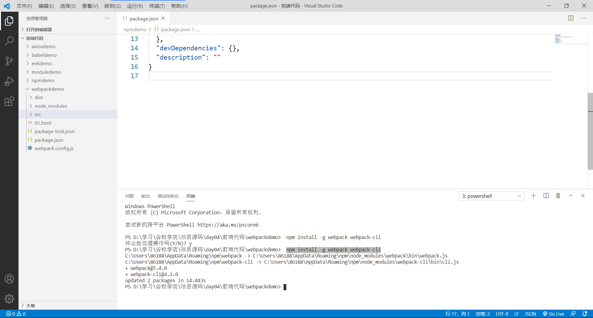
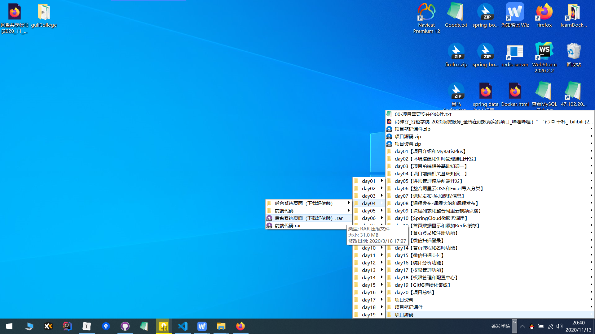
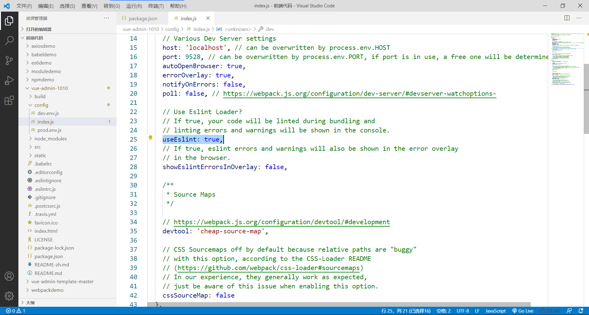
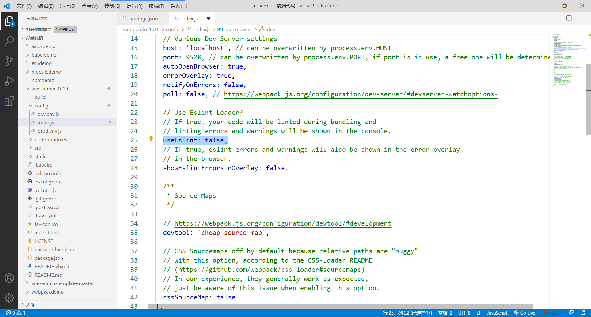
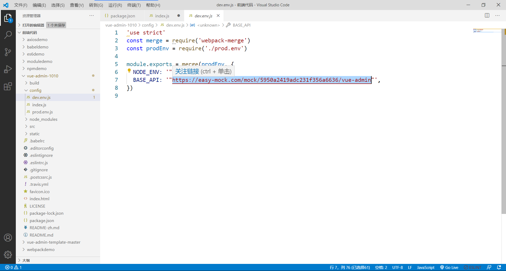
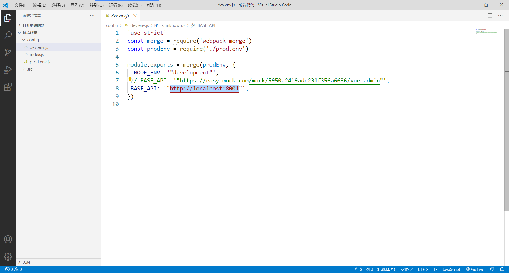

# 必须

## nodejs

https://nodejs.org/zh-cn/

## Webpack

```
npm install -g webpack webpack-cli
```



# 非必须

## vue-admin

直接用就好



## useEslint

关闭严格的代码检查，这个也不用改，直接用 day05 的前端代码即可

### 前



### 后



## 修改访问后端接口地址

直接用 day05 的前端代码即可

### 前



### 后



