# 数据库

## 参数

```properties
# mysql数据库连接
spring.datasource.driver-class-name=com.mysql.cj.jdbc.Driver
spring.datasource.url=jdbc:mysql://localhost:3306/guli?serverTimezone=GMT%2B8
spring.datasource.username=root
spring.datasource.password=root
```

## 脚本

> guli_acl.sql
> guli_cms.sql
> guli_edu.sql
> guli_order.sql
> guli_statistics.sql
> guli_ucenter.sql

# day04-前端

## 必须

### nodejs

https://nodejs.org/zh-cn/

### Webpack

```
npm install -g webpack webpack-cli
```

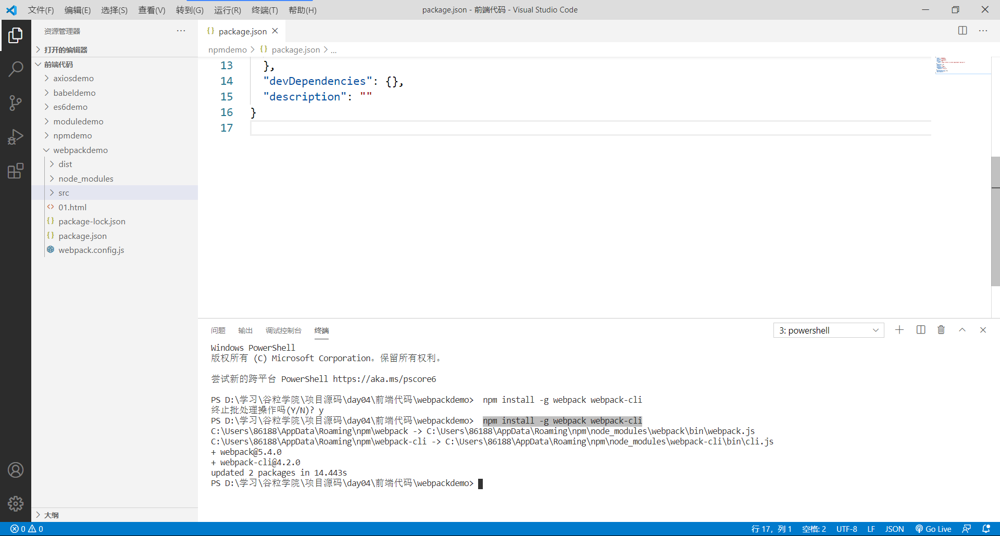

## 非必须

### vue-admin

直接用就好

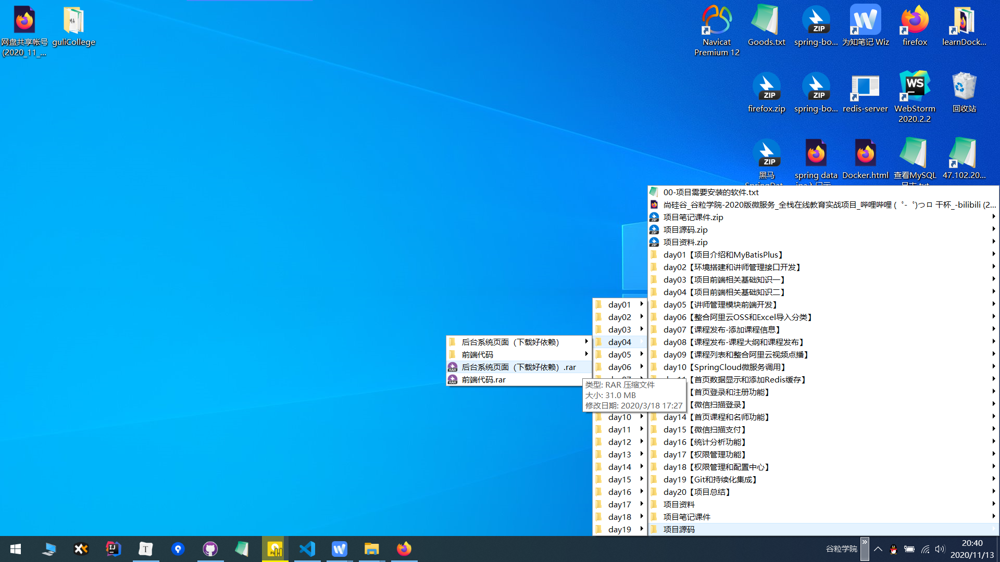

### useEslint

关闭严格的代码检查，这个也不用改，直接用 day05 的前端代码即可

#### 前


#### 后

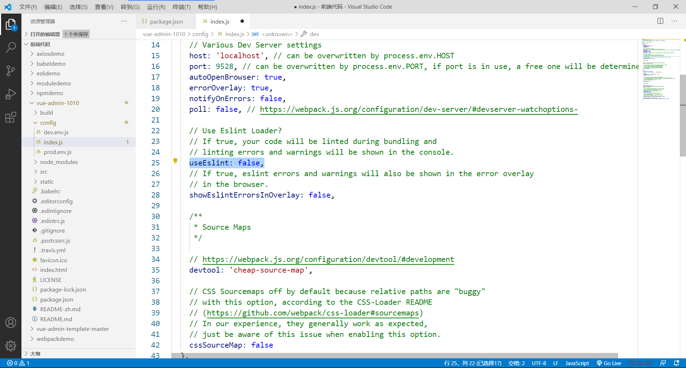

### 修改访问后端接口地址

直接用 day05 的前端代码即可

#### 前

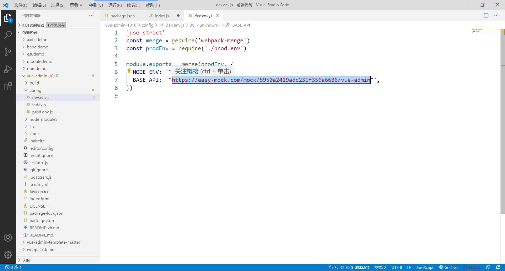

#### 后


# day07

## 准备阿里云 OSS

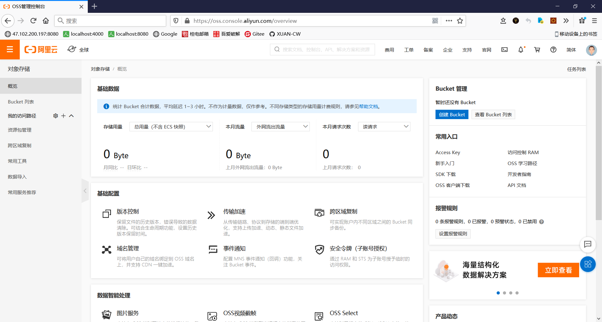

## AccessKey的创建与获取

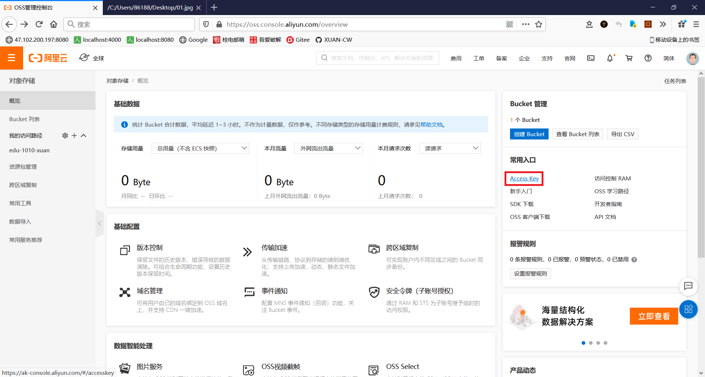


## 参考

> 03-尚硅谷-谷粒学院-阿里云oss开发准备.mp4


# day10

准备nacos

访问地址：http://localhost:8848/nacos/#/login

账号密码都是`nacos`

# day11

## 前端

### NUXT

#### 步骤

1. 直接复制 day11 的 `系统前台页面（下载好依赖）`

2. ```
   npm install
   ```

#### Error

>  ERROR  [Vue warn]: Property or method "name" is not defined on the instance but referenced during render. Make sure that this property is reactive, either in the data option, or for class-based components, by initializing the property. See: https://vuejs.org/v2/guide/reactivity.html#Declaring-Reactive-Properties.
>
> found in
>
> ---> <Pages/index.vue> at pages/index.vue
>        <Nuxt>
>          <Layouts/default.vue> at layouts/default.vue
>            <Root>
>
>
>  ERROR  [Vue warn]: Property or method "description" is not defined on the instance but referenced during render. Make sure that this property is reactive, either in the data option, or for class-based components, by initializing the property. See: https://vuejs.org/v2/guide/reactivity.html#Declaring-Reactive-Properties.        
>
> found in
>
> ---> <Pages/index.vue> at pages/index.vue
>        <Nuxt>
>          <Layouts/default.vue> at layouts/default.vue
>            <Root>

##### 原因

原因:在data中没有定义一个name, 致错

原因:在data中没有定义一个description, 致错

##### 解决方法

```html
      <h1 class="title">
        {{ name="" }}
      </h1>
      <h2 class="subtitle">
        {{ description="" }}
      </h2>
```

#### 成功的标志

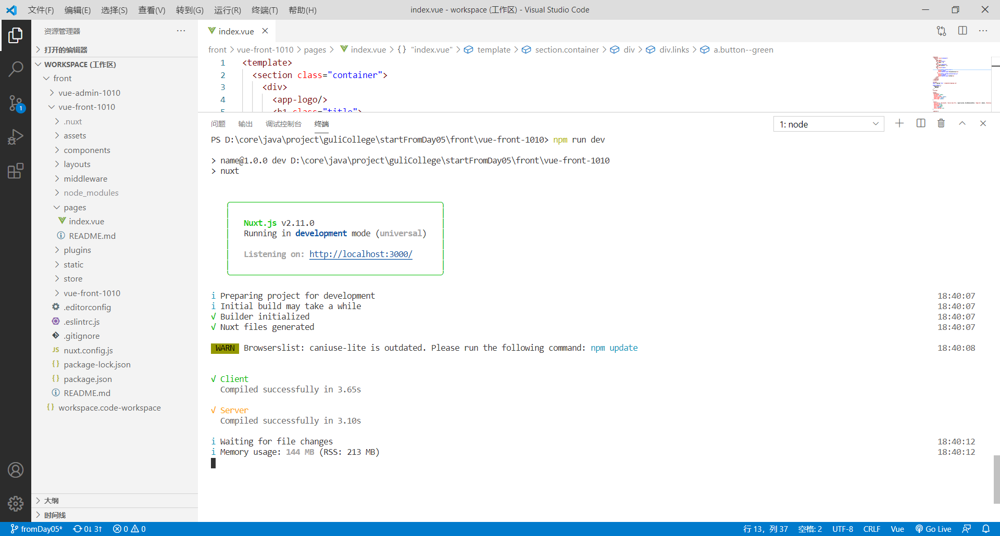

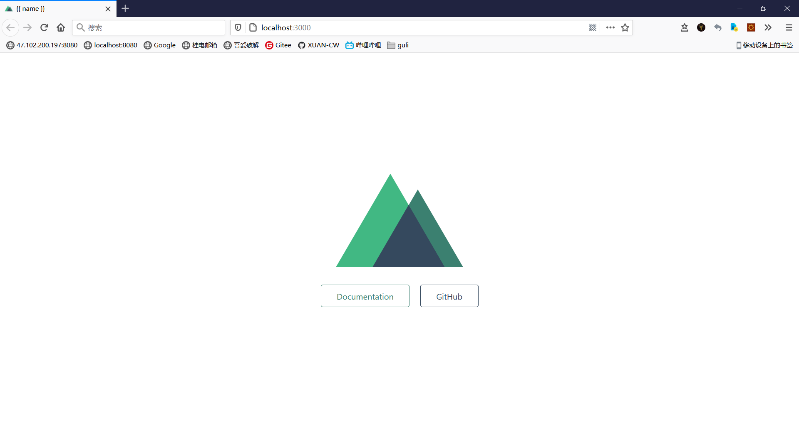

#### 参考

> day11【首页数据显示和添加Redis缓存】- 02-搭建项目前台环境（NUXT）.mp4

##  vue-awesome-swiper

安装幻灯片插件

```
npm install vue-awesome-swiper
```

## axios 

```
npm install --save axios
```

## 后端

### 数据库

准备好数据表 **crm_banner**，执行数据库脚本 `guli_cms.sql`  可得。如果你在一开始就把数据库脚本全部执行了，这里就不需要了。

## Redis

这里不用视频上的方法，使用 localhost 的 Redis，效果一致。下载并安装，一路 next 即可。由于是本地访问，所以不用像视频那样搞那么多配置，安装好，把`guli_parent/service/service_cms/src/main/resources/application.properties` 里的 `spring.redis.host`  地址配置成`spring.redis.host=127.0.0.1` 就可以了。

### 下载

[Redis-x64-3.2.100.msi](https://github.com/microsoftarchive/redis/releases/tag/win-3.2.100)

### 命令行

双击 `redis-cli.exe` 打开即可

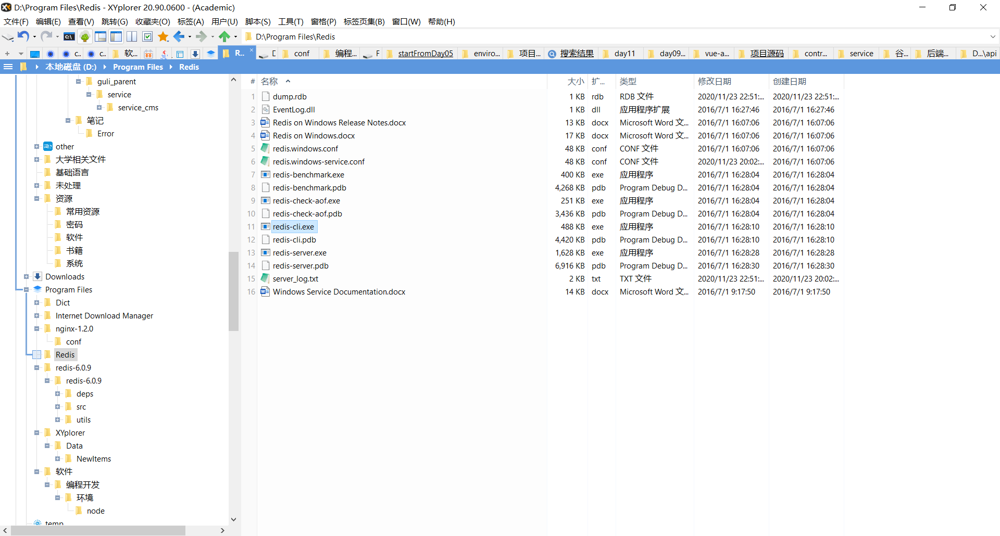

### 参考

> day11【首页数据显示和添加Redis缓存】- 12-首页数据显示-添加redis缓存（2）.mp4
> day11【首页数据显示和添加Redis缓存】- 13-首页数据显示-添加redis缓存（3）.mp4

## nginx.conf

```
        location ~ /educms/ {
            proxy_pass http://localhost:8004;
        }
```

## OSS&edu_course

### 现象

如果不出意外，这里会出问题，图片没有显示出来

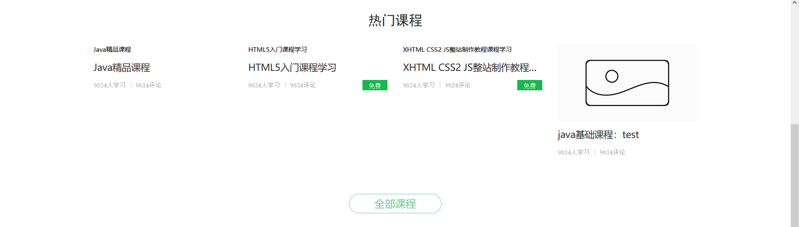

### 原因

这是因为页面 `vue-front-1010\api\index.js` 调用了 `getIndexData` 这个方法

```js
import request from '@/utils/request'

export default {
    //查询热门课程和名师
  getIndexData() {
    return request({
      url: '/eduservice/indexfront/index',
      method: 'get'
    })
  }
}
```

这个方法传到后端又调用了`guli_parent/service/service_edu/src/main/java/com/atguigu/eduservice/controller/front/IndexFrontController.java` 里的 `/eduservice/indexfront/index` ，这个方法在此查询课程数据表 `edu_course`，以此返回课程封面的 url。

```java
    @GetMapping("index")
    public R index() {
        //查询前8条热门课程
        QueryWrapper<EduCourse> wrapper = new QueryWrapper<>();
        wrapper.orderByDesc("id");
        wrapper.last("limit 8");
        List<EduCourse> eduList = courseService.list(wrapper);

        //查询前4条名师
        QueryWrapper<EduTeacher> wrapperTeacher = new QueryWrapper<>();
        wrapperTeacher.orderByDesc("id");
        wrapperTeacher.last("limit 4");
        List<EduTeacher> teacherList = teacherService.list(wrapperTeacher);

        return R.ok().data("eduList",eduList).data("teacherList",teacherList);
    }
```

如果你导入的是视频配套的数据，那么`edu_course`中的数据是这样的：

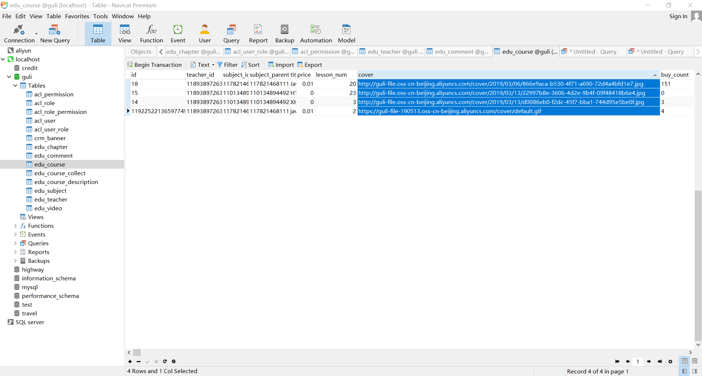

仔细查看发现，数据库中的 url 是视频中使用的 url，这个 url 其实已经失效。复制链接到浏览器地址栏中访问，发现访问不到。

#### 总结

`edu_course` 数据中的 url 已失效，造成图片没有显示出来的结果

### 解决方法

总的来说，换成可用的 url 即可。

但这里建议，上传图片到 阿里云 OSS ,再把图片对应的 url 放到数据库中。

# day12

## 短信服务

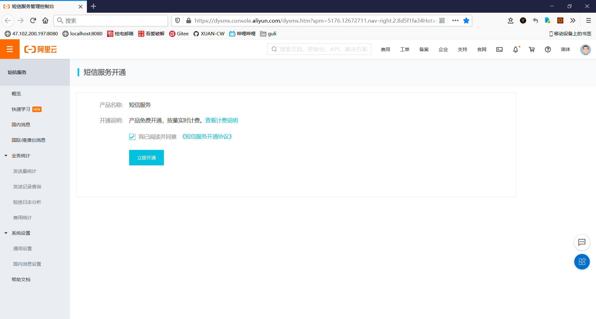

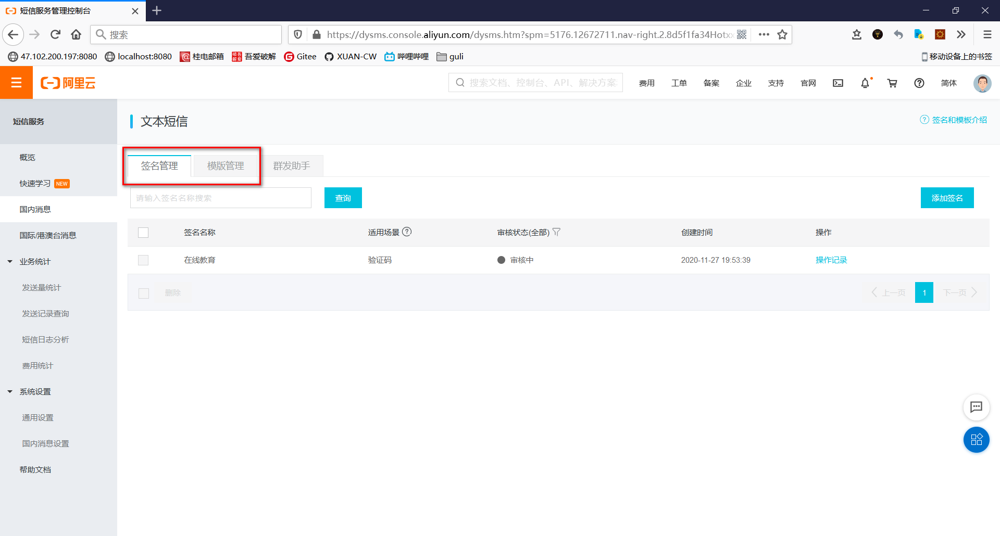

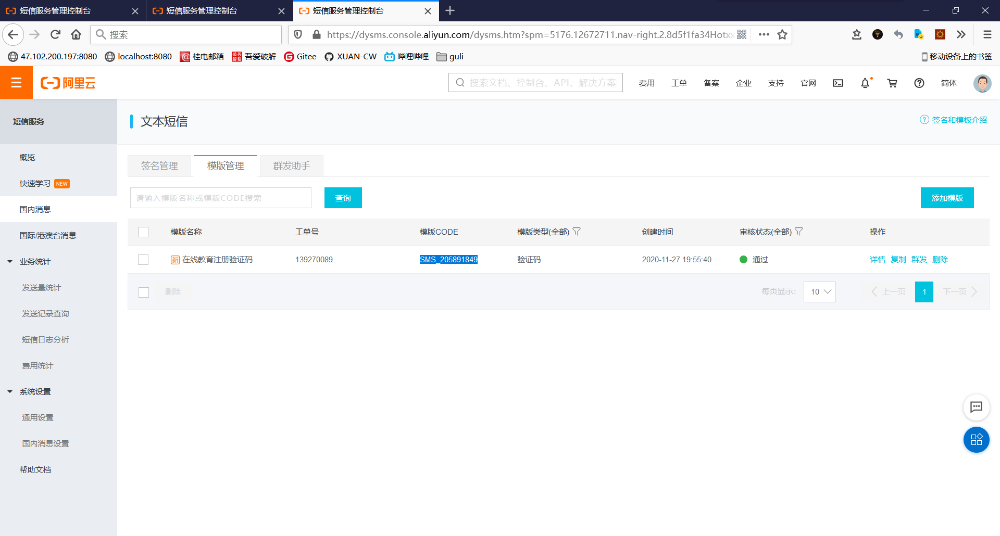

### 引用用途

`guli_parent\service\service_msm\src\main\java\com\atguigu\msmservice\service\impl\MsmServiceImpl.java`

```java
request.putQueryParameter("SignName","在线教育"); //申请阿里云 签名名称
request.putQueryParameter("TemplateCode","SMS_205891849"); //申请阿里云 模板code 
```

#### 提示

别忘了改成自己的

```java
DefaultProfile profile =
                DefaultProfile.getProfile("default", "LTAI4FvvVEWiTJ3GNJJqJnk7", "9st82dv7EvFk9mTjYO1XXbM632fRbG");
```

### 参考

> day12【首页登录和注册功能】- 06-阿里云短信服务介绍.mp4

## element-ui

vue-front-1010

```
npm install element-ui
```

## vue-qriously

vue-front-1010

```
npm install vue-qriously
```

## js-cookie

vue-front-1010

```
npm install js-cookie
```

# day13

## 微信扫描登录

准备 `wx.open.app_id` 和 `app_secret`  ，这里需要企业获取，个人无法得到，因此使用下面这个

```properties
# 微信开放平台 appid
wx.open.app_id=wxed9954c01bb89b47
# 微信开放平台 appsecret
wx.open.app_secret=a7482517235173ddb4083788de60b90e
```

### 参考

> day13【微信扫描登录】- 07-微信扫描登录（准备工作）.mp4

