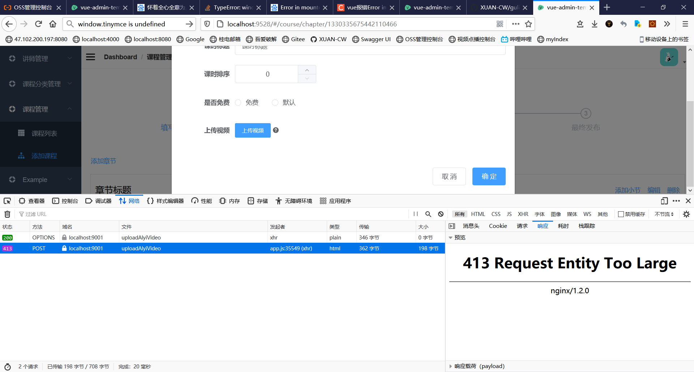
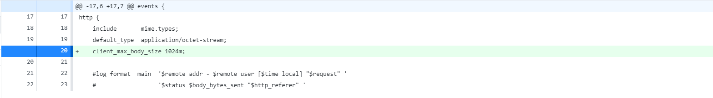

# day08

> day08【课程发布-课程大纲和课程发布】- 02-课程管理-添加课程信息完善.mp4

课程简介添加失败，以后再说，搞不定就用原来那个。

# day09

## 413 Request Entity Too Large

### 现象

### 原因

Nginx默认的 request body 为1M，我上传的视频超过 1M

### 解决方法

打开 nginx.conf 配置文件，在http{}中加入  `client_max_body_size 1024m;` ，然后重启nginx。这样，Nginx的 request body 就改成了 1024 M

