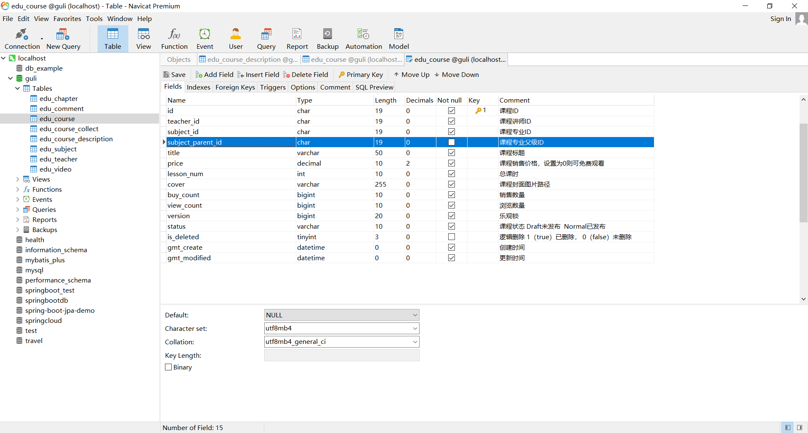

# day07【课程发布 - 添加课程信息】

##  10 - 课程管理 - 添加课程信息接口.mp4

### 问题

> \### Error updating database.  Cause: java.sql.SQLException: Field 'subject_parent_id' doesn't have a default value
> \### The error may involve com.atguigu.eduservice.mapper.EduCourseMapper.insert-Inline
> \### The error occurred while setting parameters
> \### SQL: INSERT INTO edu_course  ( id, teacher_id, subject_id,  title, price, lesson_num, cover,      gmt_create, gmt_modified )  VALUES  ( ?, ?, ?,  ?, ?, ?, ?,      ?, ? )
> \### Cause: java.sql.SQLException: Field 'subject_parent_id' doesn't have a default value
> ; Field 'subject_parent_id' doesn't have a default value; nested exception is java.sql.SQLException: Field 'subject_parent_id' doesn't have a default value
>
> ... ...

### 原因

老师给出的 sql 语句规定了 `edu_course.subject_parent_id` 非空，需要一个值，但我们写的代码没有给一个非空的值。

### 解决方法

更改表的结构，`edu_course.subject_parent_id` 设置非空

