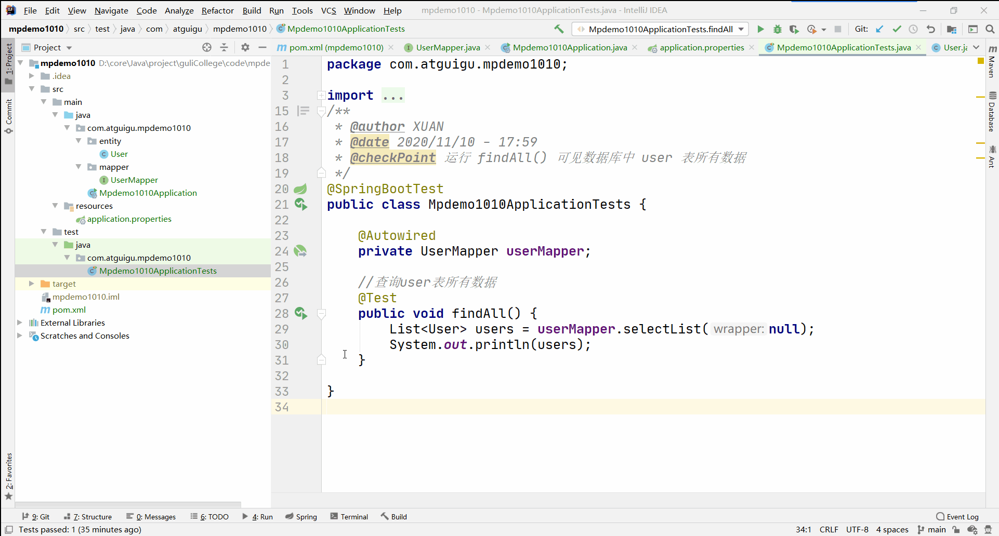
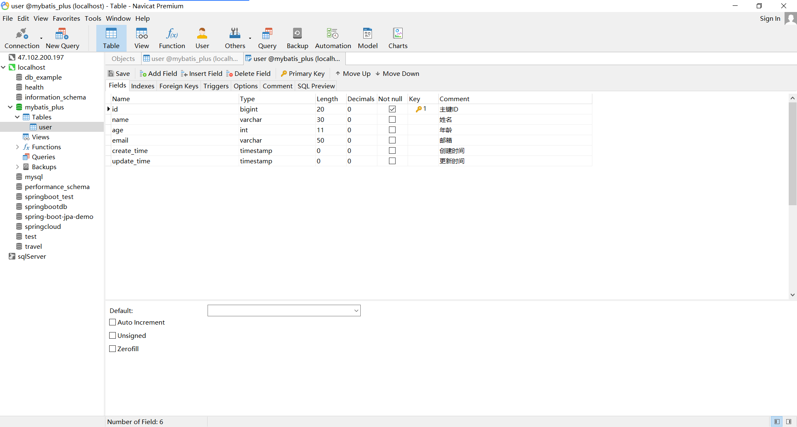
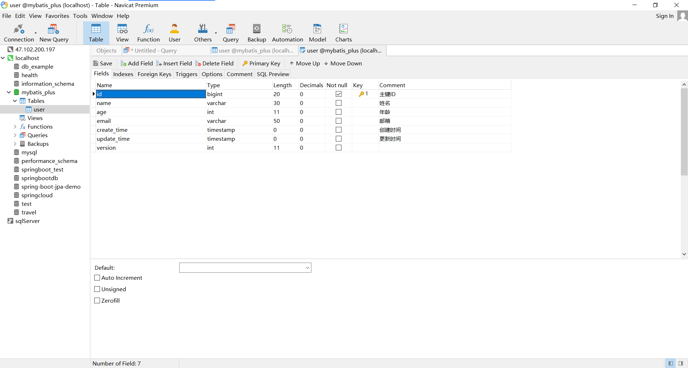

# 08-MybatisPlus入门案例

## 环境准备

### 准备数据库 mybatis_plus.user

#### 配置

```properties
spring.datasource.url=jdbc:mysql://localhost:3306/mybatis_plus?serverTimezone=GMT%2B8
spring.datasource.username=root
spring.datasource.password=root
```

#### 脚本

```mysql
Create Database If Not Exists mybatis_plus;
USE mybatis_plus;
DROP TABLE IF EXISTS `user`;
CREATE TABLE `user`  (
  `id` bigint(20) NOT NULL COMMENT '主键ID',
  `name` varchar(30) CHARACTER SET latin1 COLLATE latin1_swedish_ci NULL DEFAULT NULL COMMENT '姓名',
  `age` int(11) NULL DEFAULT NULL COMMENT '年龄',
  `email` varchar(50) CHARACTER SET latin1 COLLATE latin1_swedish_ci NULL DEFAULT NULL COMMENT '邮箱',
  PRIMARY KEY (`id`) USING BTREE
) ENGINE = InnoDB CHARACTER SET = latin1 COLLATE = latin1_swedish_ci ROW_FORMAT = Compact;

INSERT INTO `user` VALUES (1, 'Jone', 18, 'test1@baomidou.com');
INSERT INTO `user` VALUES (2, 'Jack', 20, 'test2@baomidou.com');
INSERT INTO `user` VALUES (3, 'Tom', 28, 'test3@baomidou.com');
INSERT INTO `user` VALUES (4, 'Sandy', 21, 'test4@baomidou.com');
INSERT INTO `user` VALUES (5, 'Billie', 24, 'test5@baomidou.com');
```

##   最终效果



# 11-MybatisPlus实现自动填充

## 数据库设置

### 添加字段

#### 脚本

```mysql
ALTER TABLE user ADD create_time timestamp COMMENT '创建时间';
ALTER TABLE user ADD update_time timestamp COMMENT '更新时间';
```

#### 更新结果



## 最终效果

无需调用 `user.setCreateTime()` ，运行 `updateUser() `、`addUser()` 可自动设置时间。

# 13-MybatisPlus实现乐观锁

## 数据库设置

### 添加字段

#### 脚本

```mysql
ALTER TABLE `user` ADD COLUMN `version` INT;
```

#### 更新结果



## 最终效果

### testOptimisticLocker()

- 效果：version 字段加一
- 注意：如果 version 字段为 null , 则加一失败，为了进行正确的测试，需要先给 version 赋初值。

### testOptimisticLockerFail()

直接报错

